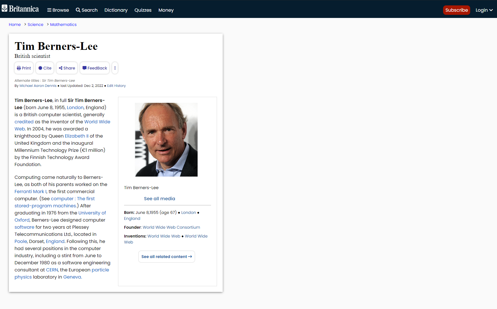
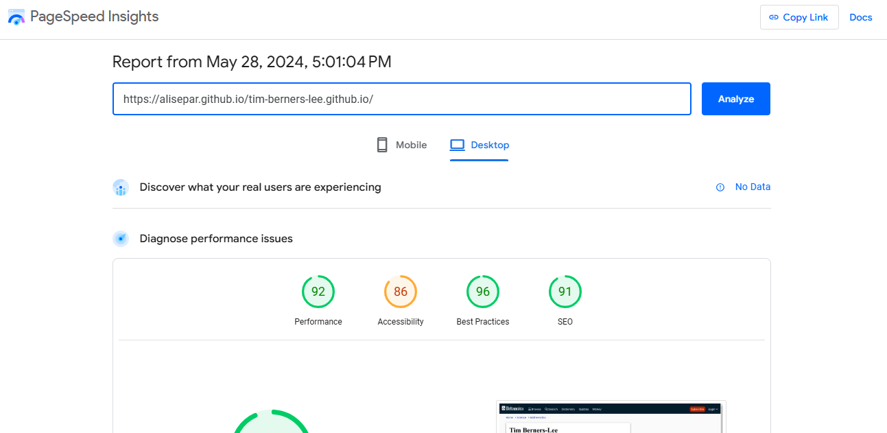

# Tim Berners-Lee Website

### description

Execersice to create a web page based on the given Markup and try to design with HTML & CSS as close as possible.

## Site Screenshot:

## Lighthouse score:

### your check the [Site](https://pagespeed.web.dev/analysis/https-alisepar-github-io-tim-berners-lee-github-io/d45xxn9lxh?hl=en-US&form_factor=desktop) for full info

